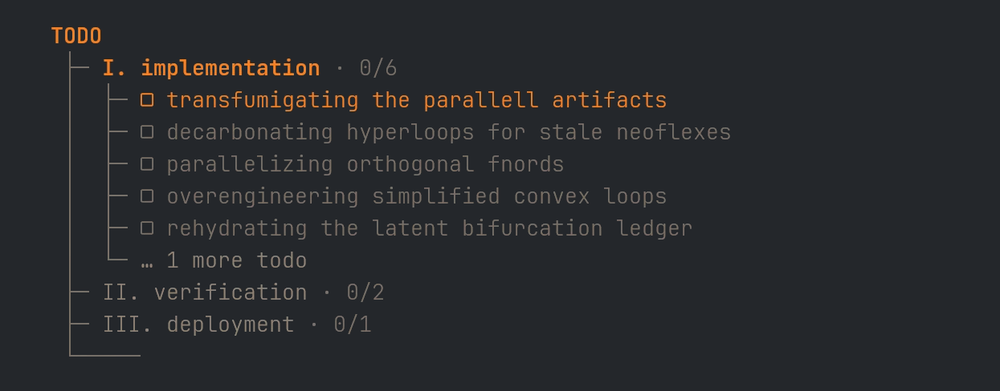
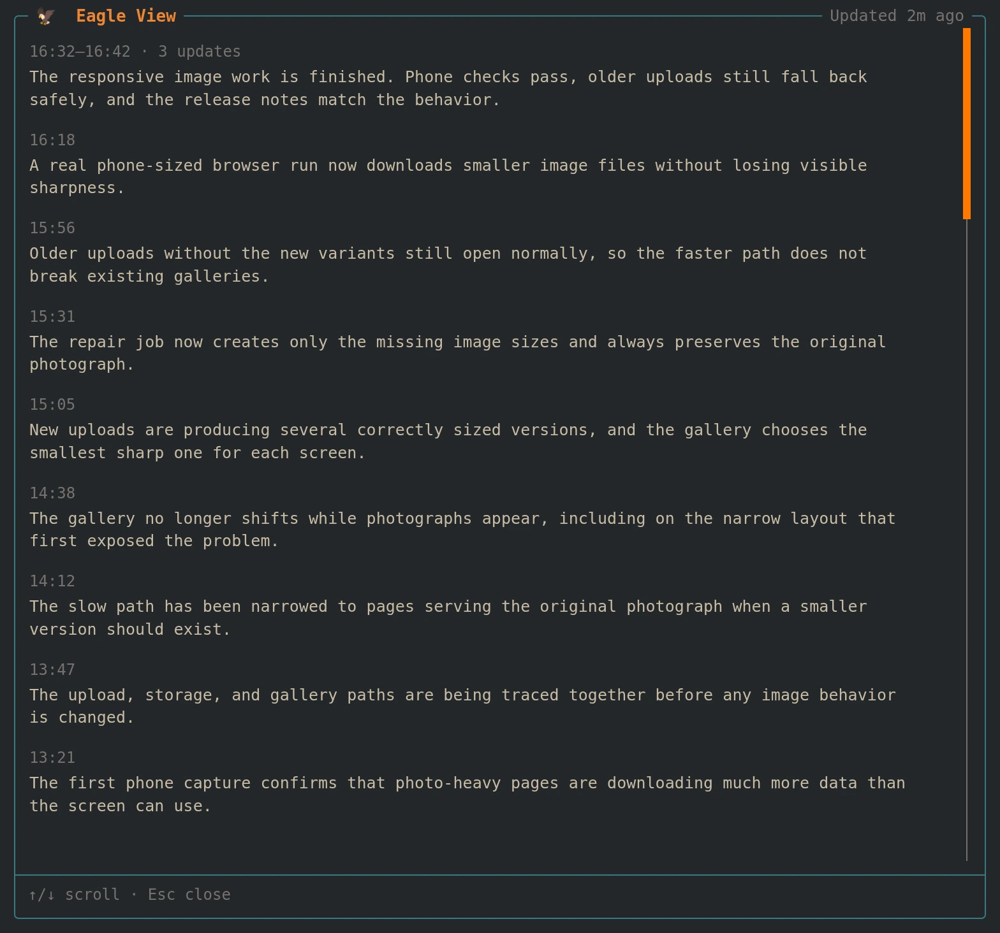

# Eagle View

Understand what your coding agent is doing at a glance.

Eagle View adds a small widget above the [OMP](https://omp.sh/) editor. It watches the session and explains the current work in one short sentence.


## When the work gets weird

Long sessions and complex tasks can sometimes leave you wondering **what on earth it is doing right now?**

OMP already shows the agent's todo plan, but when the plan looks like this it's not much comfort:



Eagle View watches the session activity and todo progression, then translates the important parts into short, everyday English. It keeps the useful context while leaving the abstract terminology behind.

## Features

- Plain-language summary updates 
- A quiet, two-line widget above the editor
- Automatic summaries only when the work has changed
- An in-memory history of every accepted update
- A scrollable message history when you want to catch up
- Configurable timing, icon, tone, and model

Open `/eagle-view inspect` for a timestamped history of accepted updates. The newest message stays at the top, new updates appear live, and consecutive exact repeats collapse into one entry:



## Install

Install directly from GitHub:

```bash
omp plugin install github:mwmdev/omp-eagle-view
```

Restart OMP, then check the installation:

```bash
omp plugin list
omp plugin doctor
```

Eagle View requires OMP 18.2.5 or newer and an authenticated model from the active provider.

### Local development

```bash
git clone https://github.com/mwmdev/omp-eagle-view.git
cd omp-eagle-view
bun install
omp plugin link "$PWD"
```

## Commands

| Command | What it does |
| --- | --- |
| `/eagle-view` | Toggle Eagle View for the current session. |
| `/eagle-view toggle` | Toggle Eagle View for the current session. |
| `/eagle-view refresh` | Generate a new update now. |
| `/eagle-view inspect` | Open the current session's update history. |

Press `Esc` or `q` to close the message history.

## Settings

See every setting and its current value:

```bash
omp plugin config list omp-eagle-view
```

Set a global value:

```bash
omp plugin config set omp-eagle-view intervalMinutes 3
```

Add `--local` to set a value for the current project only:

```bash
omp plugin config set omp-eagle-view initialEventCount 5 --local
```

| Setting | Default | Description |
| --- | --- | --- |
| `enabled` | `true` | Start Eagle View automatically. |
| `intervalMinutes` | `2` | Minutes between automatic checks. Accepts `0.25` to `1440`. |
| `initialEventCount` | `3` | Whole number of events required before the first update. Accepts `1` to `100`. |
| `icon` | `🦅` | Symbol shown before the update. Use an empty string to hide it. |
| `prompt` | Wise, plain-spoken voice | Controls wording and tone. |
| `model` | Cheapest available | Selects a model from the active provider. |

Examples:

```bash
# Use a different icon
omp plugin config set omp-eagle-view icon "✦"

# Change the voice
omp plugin config set omp-eagle-view prompt \
  "Keep it warm, brief, and easy for anyone to understand."

# Choose a model
omp plugin config set omp-eagle-view model "openai/gpt-5-mini"
```

Reset a setting to its default:

```bash
omp plugin config delete omp-eagle-view intervalMinutes
```

Settings are loaded when an OMP session starts or switches. Project settings override global settings.

## Privacy and cost

Eagle View sends a small, bounded snapshot of recent activity to the selected model. It does not read or send raw tool results, generic structured tool arguments, partial tool results, or stored transcripts.

Todo task operations are the only structured-input exception. Eagle View reads their labels and states so it can report progress accurately.

Message history and progression state stay in memory and reset with the session. Narration requests use your active provider credentials and may incur provider usage or cost. Eagle View avoids repeat requests when the work has not changed.

## Development

```bash
bun test
bun run check
```

To verify the plugin manifest and settings:

```bash
omp plugin config validate
omp plugin doctor
```
